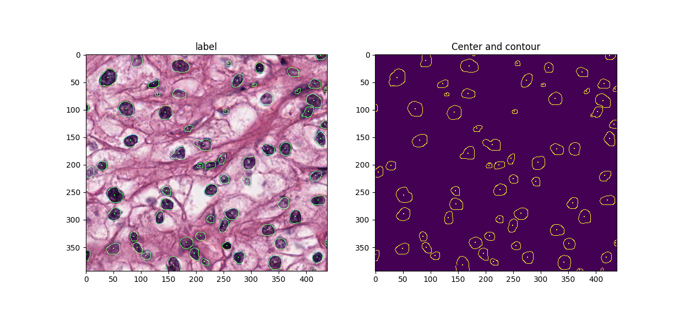

# Cell-Nuclei-Detection-and-Segmentation
This is a general prototype to detect location and draw boundary of nuclei from tissue microscopic images (H&E stained).
Model is based on U-net [1] with contour enhancement in loss function. Overlap patch based strategy is used to 1) adapt to variant input image size (resize image may stretch features); 2) use random clip and rotation for data augmentation; 3) each region in output mask is determined by combining inference result from multiple patches. 

 
### Dependencies
- Tensorflow
- OpenCV
- Scikit-image
- Numpy
- Matplotlib

#### More
- [x] detection and segmentation model
- [x] consider edge into loss function during training
- [x] morphology operation to calculate center and boundary
- [ ] better color normalization method for preprocess
- [ ] identify overlapping samples with local segmentation model
- [ ] identify tissue types 

#### Reference
[1] K.Chen, N. Zhang, L.S.Powers, J.M.Roveda, Cell Nuclei Detection and Segmentation for Computational Pathology Using Deep Learning, SpringSim 2019 Modeling and Simulation in Medicine, Society for Modeling and Simuation (SCS) International.
[2] Olaf Ronneberger, Philipp Fischer, Thomas Brox, U-Net: Convolutional Networks for Biomedical Image Segmentation,  	arXiv:1505.04597.
